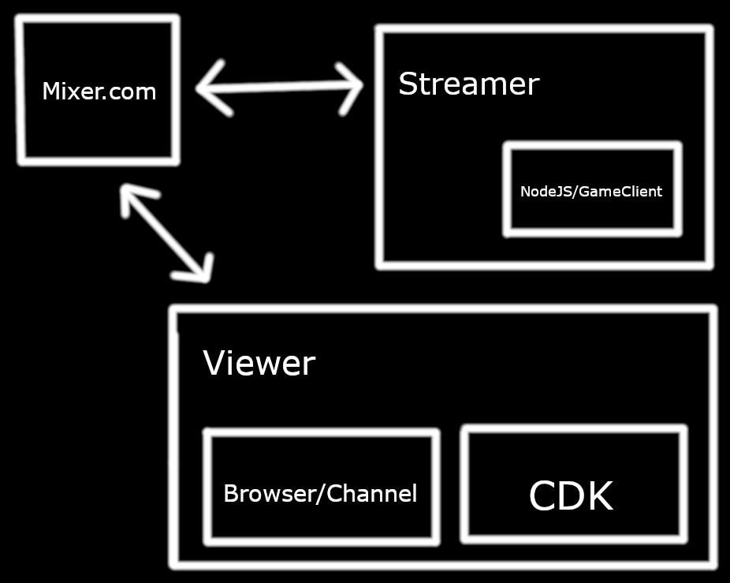
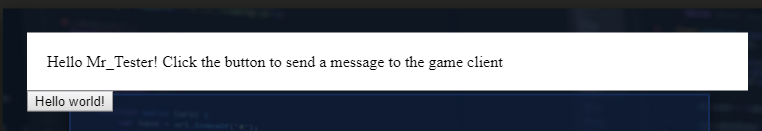
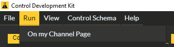
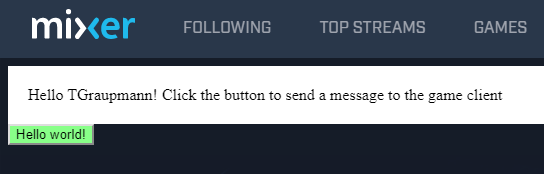
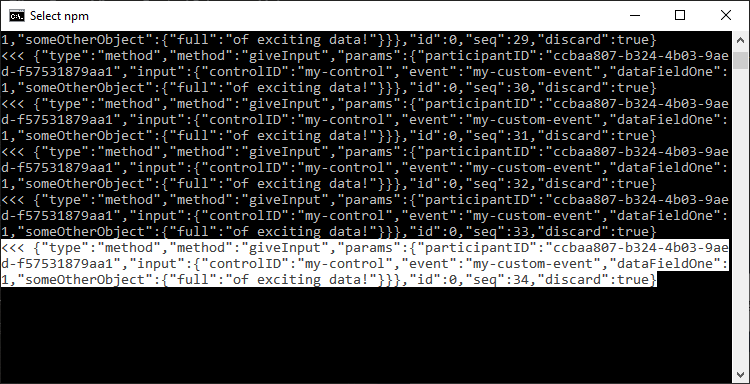
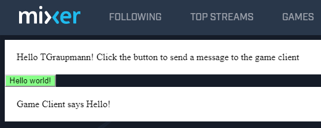

# Mixer Two Way Communication - Custom HTML5 Control

This sample project shows how to have a custom control send messages to a game client and have the game client return messages.



## References

* [Mixer - Getting Started with HTML](https://dev.mixer.com/guides/mixplay/customcontrols/gettingstartedwithhtml)

* [Mixer - Custom Controls / Game Clients](https://dev.mixer.com/guides/mixplay/customcontrols/gameclients)

## Getting Started


**The interactivePacket event**

In the custom control `scripts.js` subscribe to the `interactivePacket` to get socket events.

```
  mixer.socket.on('interactivePacket', function (event) {
    console.log(event);
  });
```

When the custom control loads, you'll see the first events that fire when the page loads.

* onSceneCreate
* onWorldUpdate
* onGroupCreate
* onParticipantJoin
* onReady


**The onParticipantJoin event**

The page username is available in the `onParticipantJoin` event. The username can be set in a div from the `index.html` page.



```
mixer.socket.on('interactivePacket', function (event) {
  if (event == undefined ||
    event.params == undefined) {
    return;
  }
  console.log('interactivePacket', event);
  if (event.method == 'onParticipantJoin' &&
    event.params.participants !== undefined &&
    event.params.participants.length > 0 &&
    event.params.participants[0] != undefined &&
    event.params.participants[0].username != undefined) {
    var divHello = document.getElementById('divHello');
    var msg = '! Click the button to send a message to the game client';
    divHello.innerText = 'Hello '+event.params.participants[0].username+msg;
  }
});
```

**Read Game client docs**

Take a look at the [game client docs](https://dev.mixer.com/guides/mixplay/customcontrols/gameclients).

**Sending data to the game client when the Hello button is clicked**

The `script.js` can use the button event to send data to the game client. The [giveInput](https://dev.mixer.com/guides/mixplay/protocol/specification#giveinput) method is from the MixPlay specifications.

```
  // Whenever someone clicks on "Hello World", we'll send an event
  // to the game client on the control ID which comes from the schema
  document.getElementById('hello-world').onclick = function(event) {
    mixer.socket.call('giveInput', {
      controlID: 'my-control',
      event: 'my-custom-event',
      dataFieldOne: 1,
      someOtherObject: {
        full: 'of exciting data!',
      },
    });
  };
```

Update the schema so the control ID matches. See that `my-control`  is the same in the schema and in `scripts.js`.

```
{
  "scenes": [
    {
      "sceneID": "default",
      "controls": [
        {
          "controlID": "my-control",
          "kind": "button",
          "text": "My First Button",
          "position": [
            {
              "width": 10,
              "height": 8,
              "size": "large",
              "x": 0,
              "y": 0
            }
          ]
        }
      ]
    }
  ]
}
```

**Setup and start the game client**

The game client needs to be running in order to send messages. Follow the Game Client [Getting Started](https://github.com/tgraupmann/Mixer_TwoWayCommunication/tree/master/nodejs-game-client) setup instructions and then launch the game client in NodeJS. This requires that you use [Mixer Developer Lab](https://mixer.com/lab/oauth) and the [Mixer interactive page](https://mixer.com/lab/interactive) to set things up. Also modify the settings in the `mixerauth.json` to match the project settings.

**Upload the Custom Control to Mixer**

The schema and custom control need to be uploaded in order for communication to work.



**Restart GameClient**

Each time the schema or custom control is uploaded, the game client should be restarted. When the game client is off, the custom control will disappear from the live channel. When the game client is started again, the custom control should reappear. The restart is necessary to see the updated schema and custom control code on the live channel.

**Send Data from Custom Control to GameClient**

Click the `Hello world!` button and that will send a message to the NodeJS server.



The information is logged in NodeJS from the [minimal_game_client.js](https://github.com/tgraupmann/Mixer_TwoWayCommunication/blob/master/nodejs-game-client/minimal_game_client.js) script from the event set in the `mixerClientOpened` method.

```
this.client.on('message', (err) => console.log('<<<', err));
```



**Game Client Reply**

When the game client receives the `giveInput` event, it can send a reply via the [broadcastEvent](https://dev.mixer.com/guides/mixplay/protocol/specification#broadcastevent) method.

```
this.client.on('message', (err) => 
{
  console.log('<<<', err);
  const blob = JSON.parse(err);
  if (blob.method == 'giveInput') {
      console.log('Sending data to custom control...');
      this.client.broadcastEvent({
        scope: ['everyone'],
        data: {
            "my-control": {
                "with": "Game Client says Hello!"
            }
        },
    });
  }
});
```

**Custom Control Display Reply**

The custom control will receive the `interactivePacket` reply and can display that in a div.



```
  mixer.socket.on('interactivePacket', function (event) {
    if (event == undefined ||
      event.params == undefined) {
      return;
    }
    console.log('interactivePacket', event);
    if (event.method == 'event' &&
      event.params['my-control'] != undefined &&
      event.params['my-control'].with != undefined) {
      var divServer = document.getElementById('divServer');
      divServer.innerText = event.params['my-control'].with;
    }
  });
```
